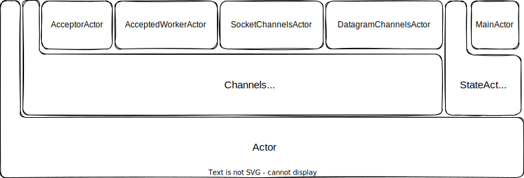

## 现有编程模型的挑战

随着摩尔定律的逐渐失效与现代软件系统规模的疯狂增长，单核CPU甚至单机已经不能很好的满足要求。为了应对这种挑战，现代软件系统不仅
需要在单机上很好运用多核CPU，甚至还需要将一个系统分布运行在多台计算机上完成业务。这些挑战严重的冲击着目前的主流编程范式，也让
目前主流编程范式向新的方向进化。

第一是异步编程，但是面向对象编程范式和异步结合的时候往往产生回调地狱，这种方法破坏了面向对象的封装性，而且也是代码逻辑更加分散，
使软件变得不容易维护。

第二是函数式编程变得更加流行，目前基本主流的编程语言都支持部分函数式特性了。函数式编程提出了一个美好的愿景：一切都是不可变的，
这使得编写代码就像定义一个数学函数，一旦函数完成定义，每次调用时只要输入一致那么输出也一致，除此之外不会有任何其余行为。这种
编程范式是一种很美妙的思想，采用这种方式编写的代码不仅安全而且更加容易测试，代码的行为也更可控。但是函数式也有一个致命的缺点：
那就是不容易处理状态，而一个现实的软件系统往往需要处理很多状态、IO等。虽然函数式编程也有Monad、Effect等组件来处理状态，但是
这些技术对于很多开发者来说难以理解，而且学习成本很高。

与此同时，有一个古老的编程范式似乎更加适合处理这种复杂的高并发分布式的软件系统。这就是1973提出的Actor模型。但是Actor模型
也同样存在一些缺点使其并没有向面向对象编程那样大规模流行起来。

`otavia` 是基于 `Scala 3` 实现的一个Actor编程模型，并且希望探索出一条Actor模型与现代编程语言进行更加有效结合的路径，
也希望探索出一些方法解决传统Actor模型的一些缺陷。文章以下内容将概括式的介绍 `otavia` 中的核心概念与设计。

## otavia 的设计哲学

面向对象编程是一种非常有用的编程思想，虽然原始的面向对象思想有点类似于Actor模型，即对象等价于Actor，但是由于直接的方法调用
的代价远远小于消息传递，现代主流的编程语言对面向对象的实现都将其退化为了一种代码组织与封装的方式。这在单线程的情况下很美好，
一切都被组织得井井有条。

但是危机发生在多线程多CPU核心之后：多线程就像一群野蛮的公牛一样在脆弱的对象丛林里横冲直撞！现在程序的执行路径不在单一，不再被
对象井井有条的管控。相反，现在你需要仔仔细细关心每一个对象是否会被多个线程同时进入，你需要仔仔细细检查程序的并发安全问题。但是
这并不容易做到，特别是对于一个规模巨大的软件系统，你不知道有多少线程在你的对象丛林里冲撞，所以你需要去人肉模拟每一个线程的运行
路径，追踪他们的运行路径，然后找出哪些对象应该需要处理并发安全问题。想象一下，你要追踪这群丛林里的野蛮公牛，一个一个细致的检查
他们踩到了哪些草丛！天啊，这想一想就让人发疯。这种挑战已经让人疲惫了，但是还有更加严重的问题：这些公牛踩到某些草丛的时候会突然
静止！他们被阻塞从而挂起了，这降低了系统CPU的使用率，而这可能又会导致启动更多的线程，并发竞争越来越严重，直到系统在一个没有被
严格检查的并发问题下崩溃！

值得高兴的是目前已经出现了一些新的技术来解决这些问题。目前如日中天的技术方案便是协程、JVM虚拟线程。但是在我看来，这些技术有效
的缓解了线程被挂起从而导致CPU使用率低的问题，但是并发竞争导致我们必须仔细设计我们的对象的问题并没有缓解。

问题变得这么严重我认为主要的原因就是目前主流编程语言和面向对象编程范式缺失了一部分关键的特性！即缺乏对并发进行组织，缺乏对执行
流的组织！而目前并发和执行流是和对象耦合在一起的，这在早期单线程环境中没有什么大的问题，但是现在多线程多CPU环境下，这些问题就
变得非常严重了！

组织并发和执行流，正是actor模型擅长的领域！而 `Scala 3` 的出现，让我看到了设计出一种更加贴合面向对象思想的actor编程工具的
愿景。 于是，在经历了很长一段时间思考之后，我设计了 `otavia` 及其相关工具集。目的是探索一种更加简单、安全的编程范式来应对
当前的挑战。也为了开拓一种新的思路提供给大家来一起推动编程思想的发展！

我认为一个更加好的代价划分体系应该像下面的层级关系，`otavia` 的设计也遵循了这种层级关系

**系统 > 进程 > 线程 > 虚拟线程/有栈协程 > `Actor > 对象 > 函数`**

在这种层级中，Actor是并发的终点，也就是说，Actor及其之后的部分都应该是单线程运行的！Actor 之间通过发送消息进行通信，多条消息
会在 Actor 的邮箱中一条一条的以单线程的方式被处理。Actor内部的逻辑您可以使用面向对象也可以选择函数式，甚至像 `Scala` 一样将
他们结合起来！现在，一切又变得简单了，你可以大胆的使用对象而不必担心那群野蛮的公牛了！

`otavia project` 是一个非常有趣的项目计划，热烈欢迎您的任何贡献！

- [GitHub - otavia-projects/otavia Your shiny new IO & Actor programming model!](https://github.com/otavia-projects/otavia)
- [GitHub - otavia-projects Ecosystem for otavia project.](https://github.com/otavia-projects)

## 核心运行时

`otavia` 中并发与资源的基本单元为 `Actor`, 对于大多数场景来说，用户只需要实现各种自定义的 `Actor` 然后通过 `Actor` 之间
的消息交互来实现整体的系统功能。但是在现有的编程基础设施中，要做到理想的 `Actor` 编程模型并不简单，因为真实的编程场景不只是程
序内部组件的交互，还涉及与系统外部的其他组件进行交互，而这又涉及 IO 编程，甚至还涉及定时任务。为了满足这些需求，`otavia` 在
原始Actor模型的基础上增加了一些新的组件。

构成 `otavia` 运行时的核心组件是：

- `Actor`: `Actor` 是 `otavia` 中并发与资源的基本单元，其有两个基本子类。`Actor` 之间通过发送消息进行通信。
    * `StateActor`：普通 `Actor` 。
    * `ChannelsActor`： 用于处理 IO 的 `Actor` 。
- `ActorSystem`: `Actor` 实例容器，负责创建`Actor` 实例、管理 `Actor` 实例的生命周期，和调度 `Actor` 实例的执行。
- `Timer`: 产生定时事件，生成超时 `Event` 并且发送给相关Actor。
- `Reactor`: 处理 IO 传输，并且把 IO 结果以 `Event` 的方式发送给 `ChannelsActor`。
- `Address`: Actor实例之间相互隔离，他们之间通过 `Address` 进行消息的发送。
- `Message`: 用于 Actor 之间相互通信，有3种基础类型的消息: `Notice`、`Reply`、`Ask[R <: Reply]`

使用 `otavia` 编程，用户必须先启动一个 `ActorSystem` 实例，这个实例代表了 `otavia` 的运行时。`ActorSystem` 里面包含了调度
Actor 实例运行的线程池，`Timer` 组件、`Reactor` 组件。接下来用户只需要使用 `ActorSystem` 启动自己的 `Actor` 实例。
`ActorSystem` 会向调用者返回对应 `Actor` 实例的地址。接下来，用户就可以通过这个 `Address` 向 Actor 发送消息了。
一旦 Actor 接收到消息，`ActorSystem` 就会分配一个空闲线程来执行这个 Actor 实例。

另一种 Actor 实例获得线程执行的条件是收到 `Event`。 在 `otavia` 中 `Event` 只能由 `Timer` 和 `Reactor` 产生， 用户
编程时只需要关心由 `Timer` 产生的 `Event`， 处理由 `Reactor` 产生的 `Event` 由 `ChannelsActor` 进行了进一步的
封装。

## Actor

`otavia` 中有两类基本的 `Actor` ，`StateActor` 和 `ChannelsActor`， 用户可以根据自己的需要选择继承其中的一种。

`StateActor`: 普通 Actor ， 用户可以实现这种 Actor 来管理状态，发送、接收消息。这种 Actor 还可以与 `Timer` 进行交互
用于注册一个超时事件，当超时事件触发的时候， `Timer` 会向 Actor 发送 `Event`， 然后 `ActorSystem` 调度 Actor 执行
以处理 `Event`。

`ChannelsActor`：在 `StateActor` 功能的基础之上新增了管理 `Channel` 的功能，`otavia` 中的 `Channel` 从 Netty 移植
而来，也基本跟 Netty 保持一致。但是与 Netty 不同的是，`otavia` 中的 `Channel` 必须跟一个 `ChannelsActor` 绑定，以
`ChannelsActor` 的一部分进行运行。

为了方便使用，`otavia` 根据不同的场景抽象了以下几种常用的Actor，您可以继承其中的一种来实现您的功能：

### 各种 ChannelsActor

为了更好的对各种不同 `Channel` 的管理，`otavia` 实现了几种不同种类的 `ChannelsActor`，他们分别是：

- `AcceptorActor`: 管理TCP监听的Channel，其需要实例化一组 `AcceptedWorkerActor`, 对于监听Channel接受的普通 `Channel`
  会作为消息发送给其中一个 `AcceptedWorkerActor`, 并且由 `AcceptedWorkerActor` 对接受的 `Channel` 进行管理。
- `AcceptedWorkerActor`: `AcceptorActor` 的工作 Actor。
- `SocketChannelsActor`: 管理TCP客户端 `Channel`。
- `DatagramChannelsActor`: 管理UDP `Channel`。

## Channel

在 `otavia` 中，一个 `Channel` 就代表一个IO对象，比如一个打开的文件、一个网络连接等，因为 `Channel` 是从 Netty 移植而来，
所以基本的组件也跟 Netty 差不多，也有 `ChannelPipeline` `ChannelHandler` `ChannelHandlerContext` 等组件，并且工作
方式也跟 Netty 差不多。

但是为了 Channel 更好的与 otavia 的 Actor 结合，也需要做出一些调整：

1. Netty 的 `Channel` 创建成功后需要注册到 `EventLoop` 上，`EventLoop` 是一个线程，这个线程会监听IO事件，然后调度相关的
   `Channel` 进行执行。同样对于 outbound 调用，也需要转换成任务提交到 `EventLoop` 线程上排队执行。`otavia` 中没有
   `EventLoop`，`otavia` 中的 `Channel` 创建成功后需要挂载到一个 `ChannelsActor` 内，`ChannelsActor` 会将 `Channel` 中的
   `UnsafeChannel` 注册到 `Reactor` 上，`Reactor` 会监听相关 `Channel` 的IO事件，然后产生`Event` 发送给挂载的
   `ChannelsActor`，`ChannelsActor` 被调度执行的时候会将 `Event` 分配给相关的 `Channel` 执行 inbound 流程。
2. Netty 的 `EventLoop` 不仅监听IO事件，而且IO事件发生的时候还会调度相关的 Channel 进行执行，IO的监听、IO数据的读写和
   ChannelPipeline 的执行都在同一个 `EventLoop` 线程内。但是 `otavia` 中IO的监听、IO数据的读写由 Reactor 负责，
   然后按需生成相关的 Event 发送给 `ChannelsActor`， 由 ChannelsActor 负责调度 ChannelPipeline 的执行。
3. Netty 中所有的业务逻辑都必须封装成 ChannelHandler 放入 ChannelPipeline 中执行，如果一个inbound事件到达
   ChannelPipeline 尾部 TailHandler 仍然没有处理，那么 Netty 会忽略掉这个事件。但是 otavia 中 inbound 事件到达
   TailHandler 之后会到达 Channel 内的 Inflight，然后由 Inflight 分发给 `ChannelsActor` 内部的 `Stack` 处理。
   事实上，在 otavia 中 ChannelPipeline 的职责更加集中在字节序列的转换与编解码工作，比如TLS、压缩、数据对象的序列化
   与反序列化等。其他复杂的业务逻辑直接通过将反序列化的对象传入 Channel 的 Inflight 组件，然后交给 `ChannelsActor` 处理。

### ChannelPipeline

ChannelPipeline 与 Netty 中的 ChannelPipeline 基本一致，首位节点分别是 HeadHandler 和 TailHandler，当 Channel
初始化的时候，用户可以通过Channel向ChannelPipeline中添加自定义的 ChannelHandler，与Netty一样，ChannelHandler也被
`ChannelHandlerContext`包裹，然后由 `ChannelHandlerContext` 将所有的 ChannelHandler 串联起来。

Reactor 向 ChannelsActor 发送来的 ReactorEvent 会触发 ChannelPipeline 的 inbound 事件，inbound 事件从 HeadHandler
向 TailHandler 方向传递。调用Channel的outbound相关的方法会触发outbound事件从 TailHandler 向 HeadHandler 方向传递。
outbound 事件到达 HeadHandler 之后最终会转化为提交到 `Reactor` 的命令。

#### Channel Inflight

## 消息模型

## 事件

## Stack

## Timer

## 生态系统中其他的核心模块

### CPS变换

### Buffer

### 序列化反序列化框架

### SQL

### 日志

### 测试工具